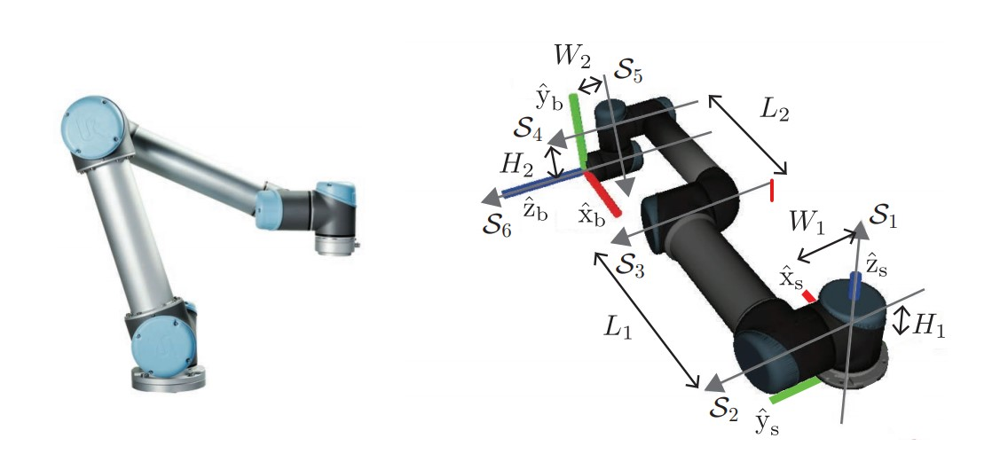
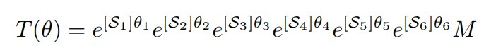

# ur5-poe-fkine
Forward kinematics exercise with product of exponential matrices for the UR5 robot.

## UR5 Diagram & Forward Kinematic Equation

## Result

I got the exercise from the textbook I used to learn robotics in chapter 4 example 5 [1]. 
The example set the second angle joint to -pi/2 and the fifth angle joint to pi/2 with every other angle set to 0:

I got the same result using the python script I wrote:

## References

[1]. “Forward Kinematics.” Modern Robotics: Mechanics, Planning, and Control, by Kevin M. Lynch and Frank C. Park, Cambridge University Press, 2019.  
